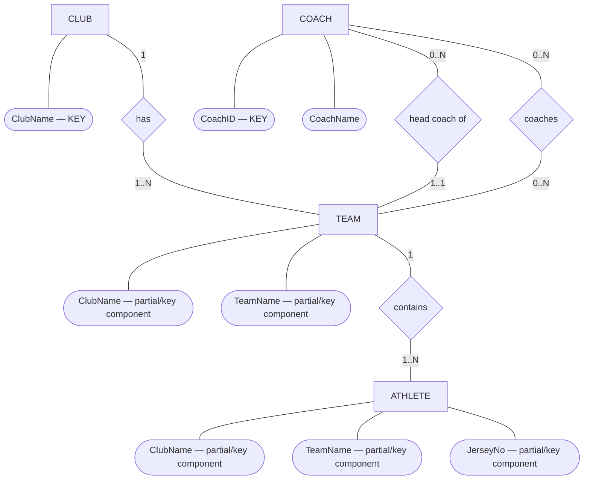
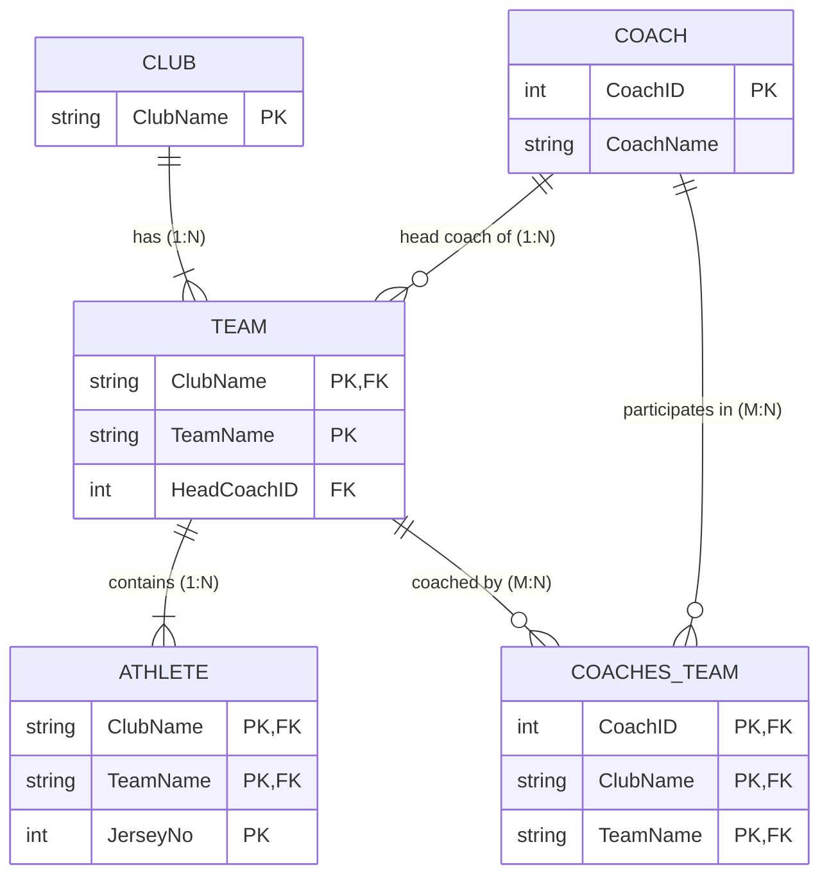

# ER Diagram & Relational Schema — Mock Test 1 (Sports Center)

This file shows **both representations of the same database**:

1. **ER Diagram (conceptual model)** — entities, attributes, relationships, cardinalities.
2. **Relational Schema (logical/table model)** — tables, primary keys, foreign keys, and constraints.

> Note: Mermaid's built-in `erDiagram` uses Crow's Foot notation rather than classic Chen ovals/diamonds.  
> The first diagram below therefore uses a Mermaid `flowchart` to imitate **Chen notation**.

---

# 1. ER Diagram — Chen-Style

### Meaning

- **Club & Team (`has`):** One **CLUB** has one or more **TEAMs** ($1:N$, total participation on `TEAM`). `TEAM` is existence-dependent on `CLUB`; team names are unique only within a club.
- **Team & Athlete (`contains`):** One **TEAM** contains one or more **ATHLETEs** ($1:N$, total participation on `ATHLETE`). `ATHLETE` is existence-dependent on `TEAM`; jersey numbers are unique only within that team.
- **Head Coach (`head coach of`):** Each **TEAM** has **exactly one** head coach ($1:N$, total participation on `TEAM`). A **COACH** may be the head coach of zero or more teams.
- **General Coaching (`coaches`):** A **COACH** may coach zero or more **TEAMs**, and a **TEAM** may have zero or more **COACHes** ($M:N$ relationship).
- **Head Coach Consistency:** The head coach of a team must also participate in the general `coaches` relationship for that team.

---

# 2. Relational Schema — Tables, PKs and FKs

## Relational notation

### CLUB

**CLUB**(`ClubName`)

- **PK:** `ClubName`

### COACH

**COACH**(`CoachID`, CoachName)

- **PK:** `CoachID`

### TEAM

**TEAM**(`ClubName`, `TeamName`, HeadCoachID)

- **PK:** (`ClubName`, `TeamName`)
- **FK:** `ClubName` → `CLUB(ClubName)`
- `ON DELETE CASCADE`
- **FK:** `HeadCoachID` → `COACH(CoachID)`
- `NOT NULL` *(ensures every team has a head coach)*

### ATHLETE

**ATHLETE**(`ClubName`, `TeamName`, `JerseyNo`)

- **PK:** (`ClubName`, `TeamName`, `JerseyNo`)
- **FK:** (`ClubName`, `TeamName`) → `TEAM(ClubName, TeamName)`
- `ON DELETE CASCADE`

### COACHES_TEAM

**COACHES_TEAM**(`CoachID`, `ClubName`, `TeamName`)

- **PK:** (`CoachID`, `ClubName`, `TeamName`)
- **FK:** `CoachID` → `COACH(CoachID)`
- `ON DELETE CASCADE`
- **FK:** (`ClubName`, `TeamName`) → `TEAM(ClubName, TeamName)`
- `ON DELETE CASCADE`

---

# Quick Exam Distinction

| ER Diagram | Relational Schema |
|---|---|
| Conceptual design | Logical/table design |
| Entity → rectangle | Relation → table |
| Attribute → oval | Attribute → column |
| Relationship → diamond | Relationship → foreign key |
| Shows 1:1, 1:N, M:N | Shows PK/FK references |
| Used before conversion | Result after ER-to-relational mapping |

**Memory rule:**

> **ER diagram:** What entities exist and how are they related?  
> **Relational schema:** What tables do I create, and what are their PKs/FKs?
