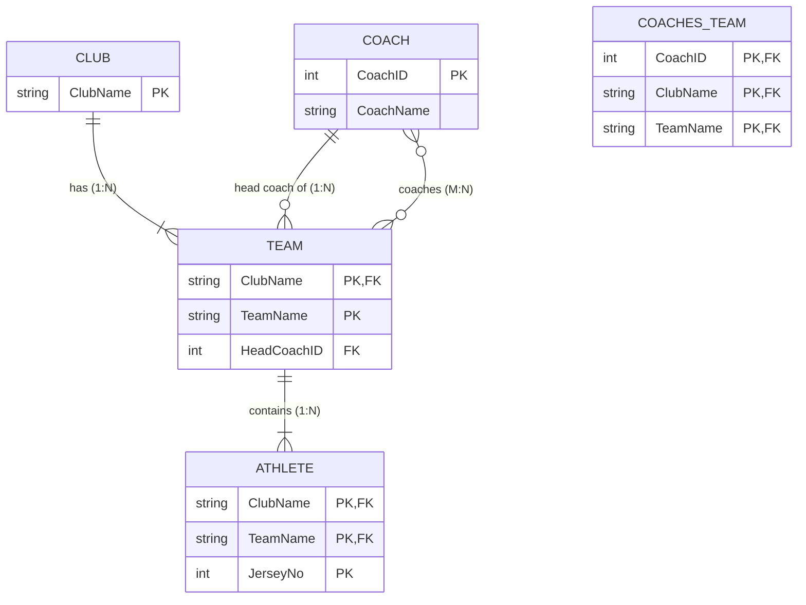

# Mock Test 1 — ER Diagram & Relational Schema

---

## 1. Relationship Cardinality Breakdown

| Relationship | Entity 1 (Card / Part) | Entity 2 (Card / Part) | Ratio | Design / Mapping Semantics |
| :--- | :--- | :--- | :--- | :--- |
| **has** | `CLUB` (1, total: 1..N) | `TEAM` (N, total: 1..1) | **1 : N** | Each team belongs to **exactly 1** club (weak identification). A club must have **at least 1** team. |
| **contains** | `TEAM` (1, total: 1..N) | `ATHLETE` (N, total: 1..1) | **1 : N** | Each athlete belongs to **exactly 1** team. A team contains **1 or more** athletes. |
| **head coach of** | `COACH` (1, partial: 0..N) | `TEAM` (N, total: 1..1) | **1 : N** | Each team has **exactly 1** head coach (FK in `TEAM`, `NOT NULL`). A coach can head **0..N** teams. |
| **coaches** | `COACH` (M, partial: 0..N) | `TEAM` (N, partial: 0..N) | **M : N** | General/assistant coaching. A coach can coach **0..N** teams, and a team can have **0..N** coaches. |

---

## 2. Relational Schema

- **`CLUB`** (**`ClubName`**)
  - **PK:** `ClubName`

- **`COACH`** (**`CoachID`**, `CoachName`)
  - **PK:** `CoachID`

- **`TEAM`** (**`ClubName`**, **`TeamName`**, `HeadCoachID`)
  - **PK:** `(ClubName, TeamName)`
  - **FK:** `ClubName` $\to$ `CLUB(ClubName)` (ON DELETE CASCADE)
  - **FK:** `HeadCoachID` $\to$ `COACH(CoachID)` (`NOT NULL`)

- **`ATHLETE`** (**`ClubName`**, **`TeamName`**, **`JerseyNo`**)
  - **PK:** `(ClubName, TeamName, JerseyNo)`
  - **FK:** `(ClubName, TeamName)` $\to$ `TEAM(ClubName, TeamName)` (ON DELETE CASCADE)

- **`COACHES_TEAM`** (**`CoachID`**, **`ClubName`**, **`TeamName`**) *(Associative relation for M:N `coaches`)*
  - **PK:** `(CoachID, ClubName, TeamName)`
  - **FK:** `CoachID` $\to$ `COACH(CoachID)` (ON DELETE CASCADE)
  - **FK:** `(ClubName, TeamName)` $\to$ `TEAM(ClubName, TeamName)` (ON DELETE CASCADE)

---

## 3. Key Notes & Constraints
- **Weak Entity Propagation:** `TEAM` is weak/scoped relative to `CLUB`, so its primary key includes `ClubName`. `ATHLETE` is weak/scoped relative to `TEAM`, so its primary key includes `(ClubName, TeamName, JerseyNo)`.
- **Head Coach vs General Coach:** Total participation of `TEAM` in `head coach of` forces `HeadCoachID` in `TEAM` to be non-null. The $M:N$ `coaches` relationship requires the separate junction table `COACHES_TEAM`.

