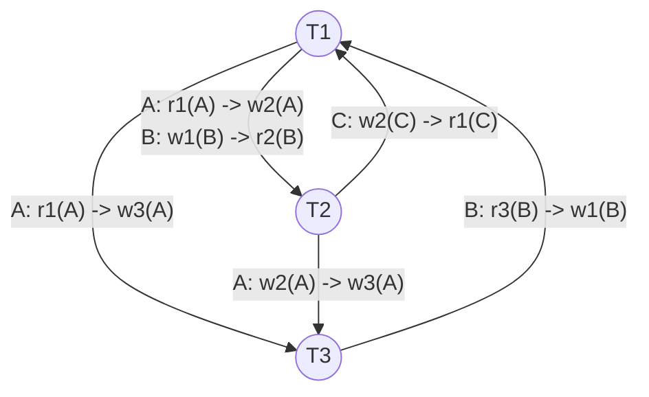

# Mock Test 1 — Precedence Graph & Concurrency Solution

## Question 4: Serialization & Concurrency
Given schedule $S$:
$$S = r_1(A)\ w_2(A)\ r_3(B)\ w_1(B)\ r_2(B)\ w_3(A)\ w_2(C)\ r_1(C)$$

---

## 1. Conflict Analysis & Precedence Graph

### Conflicting Operations Breakdown
A conflict occurs between two operations $op_i, op_j$ belonging to different transactions ($i \neq j$) if both access the same data item and at least one is a write (`write`).

| Data Item | Preceding Op | Succeeding Op | Edge Direction | Conflict Type | Rationale |
| :---: | :---: | :---: | :---: | :---: | :--- |
| **A** | $r_1(A)$ | $w_2(A)$ | $T_1 \to T_2$ | **WAR** (Write-After-Read) | $T_1$ reads $A$ before $T_2$ overwrites $A$ |
| **A** | $r_1(A)$ | $w_3(A)$ | $T_1 \to T_3$ | **WAR** (Write-After-Read) | $T_1$ reads $A$ before $T_3$ overwrites $A$ |
| **A** | $w_2(A)$ | $w_3(A)$ | $T_2 \to T_3$ | **WAW** (Write-After-Write) | $T_2$ writes $A$ before $T_3$ writes $A$ |
| **B** | $r_3(B)$ | $w_1(B)$ | $T_3 \to T_1$ | **WAR** (Write-After-Read) | $T_3$ reads $B$ before $T_1$ overwrites $B$ |
| **B** | $w_1(B)$ | $r_2(B)$ | $T_1 \to T_2$ | **RAW** (Read-After-Write) | $T_2$ reads $B$ written by $T_1$ |
| **C** | $w_2(C)$ | $r_1(C)$ | $T_2 \to T_1$ | **RAW** (Read-After-Write) | $T_1$ reads $C$ written by $T_2$ |

---

### Precedence Graph $P(S)$

---

## 2. Conflict Serializability Test

- **Cycle Identification:**
  - Cycle 1: $T_1 \xrightarrow{\text{A}} T_3 \xrightarrow{\text{B}} T_1$ (Length 2)
  - Cycle 2: $T_1 \xrightarrow{\text{A, B}} T_2 \xrightarrow{\text{C}} T_1$ (Length 2)
  - Cycle 3: $T_1 \xrightarrow{\text{A}} T_2 \xrightarrow{\text{A}} T_3 \xrightarrow{\text{B}} T_1$ (Length 3)

- **Conclusion:**
  > [!IMPORTANT]
  > Schedule $S$ is **NOT conflict-serializable** because its precedence graph contains cycles.

---

## 3. Recoverability & Cascadelessness

- **Commit Order:** $c_3 \to c_1 \to c_2$
- **Read-From Dependencies:**
  - $T_2$ reads $B$ from $T_1$ ($w_1(B) \to r_2(B)$) $\implies T_2$ depends on $T_1$.
  - $T_1$ reads $C$ from $T_2$ ($w_2(C) \to r_1(C)$) $\implies T_1$ depends on $T_2$.

- **Evaluation:**
  - For $T_2 \implies T_1$: $T_1$ commits before $T_2$ ($c_1 < c_2$), which satisfies recoverability for this read.
  - For $T_1 \implies T_2$: $T_1$ reads $C$ written by $T_2$, but $T_1$ commits **before** $T_2$ ($c_1 < c_2$). If $T_2$ aborts, $T_1$ will have committed reading an uncommitted value.

> [!WARNING]
> - **Recoverable:** **No**, because $T_1$ reads from $T_2$ but commits ($c_1$) before $T_2$ commits ($c_2$).
> - **Cascadeless:** **No**, because transactions ($T_2$ and $T_1$) read uncommitted data written by active transactions.

---

## 4. Strict 2PL Analysis

> [!NOTE]
> **Strict 2Phase Locking (Strict 2PL)** requires that all exclusive (write) locks acquired by a transaction be held until that transaction completes (commits or aborts).

- In schedule $S$, $T_1$ writes $B$ ($w_1(B)$) at step 4 and holds exclusive lock $X(B)$. Under Strict 2PL, $T_1$ cannot release $X(B)$ until $c_1$.
- At step 5, $T_2$ attempts $r_2(B)$, which requires a shared lock $S(B)$. Since $T_1$ still holds $X(B)$, $T_2$ would be **blocked**.
- Therefore, Strict 2PL **would NOT permit** this exact interleaved execution sequence.
