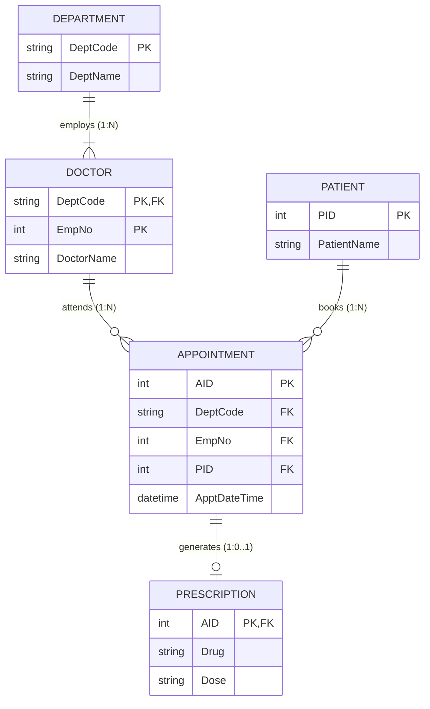

# Mock Test 2 — ER Diagram & Relational Schema

---

## 1. Relationship Cardinality Breakdown

| Relationship | Entity 1 (Card / Part) | Entity 2 (Card / Part) | Ratio | Design / Mapping Semantics |
| :--- | :--- | :--- | :--- | :--- |
| **employs** | `DEPARTMENT` (1, total: 1..N) | `DOCTOR` (N, total: 1..1) | **1 : N** | A department employs **1 or more** doctors. Each doctor belongs to **exactly 1** department (`DeptCode` in PK). |
| **attends** | `DOCTOR` (1, partial: 0..N) | `APPOINTMENT` (N, total: 1..1) | **1 : N** | A doctor attends **0..N** appointments. Each appointment is attended by **exactly 1** doctor (`DeptCode, EmpNo` FK). |
| **books** | `PATIENT` (1, partial: 0..N) | `APPOINTMENT` (N, total: 1..1) | **1 : N** | A patient books **0..N** appointments. Each appointment is booked by **exactly 1** patient (`PID` FK). |
| **generates** | `APPOINTMENT` (1, partial: 0..1) | `PRESCRIPTION` (1, total: 1..1) | **1 : 0..1** | An appointment produces **at most 1** prescription. A prescription belongs to **exactly 1** appointment (`AID` as PK & FK). |

---

## 2. Relational Schema

- **`DEPARTMENT`** (**`DeptCode`**, `DeptName`)
  - **PK:** `DeptCode`

- **`DOCTOR`** (**`DeptCode`**, **`EmpNo`**, `DoctorName`)
  - **PK:** `(DeptCode, EmpNo)`
  - **FK:** `DeptCode` $\to$ `DEPARTMENT(DeptCode)` (ON DELETE CASCADE)

- **`PATIENT`** (**`PID`**, `PatientName`)
  - **PK:** `PID`

- **`APPOINTMENT`** (**`AID`**, `DeptCode`, `EmpNo`, `PID`, `ApptDateTime`)
  - **PK:** `AID`
  - **UNIQUE:** `(DeptCode, EmpNo, ApptDateTime)` *(Natural Key constraint: a doctor cannot be double-booked)*
  - **FK:** `(DeptCode, EmpNo)` $\to$ `DOCTOR(DeptCode, EmpNo)` (`NOT NULL`)
  - **FK:** `PID` $\to$ `PATIENT(PID)` (`NOT NULL`)

- **`PRESCRIPTION`** (**`AID`**, `Drug`, `Dose`)
  - **PK:** `AID`
  - **FK:** `AID` $\to$ `APPOINTMENT(AID)` (ON DELETE CASCADE)

---

## 3. Key Notes & Constraints
- **Scoped Key:** `DOCTOR` is identified by `(DeptCode, EmpNo)`.
- **Surrogate vs Natural Key:** `APPOINTMENT` uses surrogate key `AID` as primary key; the natural candidate key `(DeptCode, EmpNo, ApptDateTime)` must be declared `UNIQUE`.
- **1:1 Optionality:** `PRESCRIPTION` shares `AID` as both its primary key and foreign key referencing `APPOINTMENT(AID)`. Total participation on the `PRESCRIPTION` side means no orphan prescriptions can exist.

