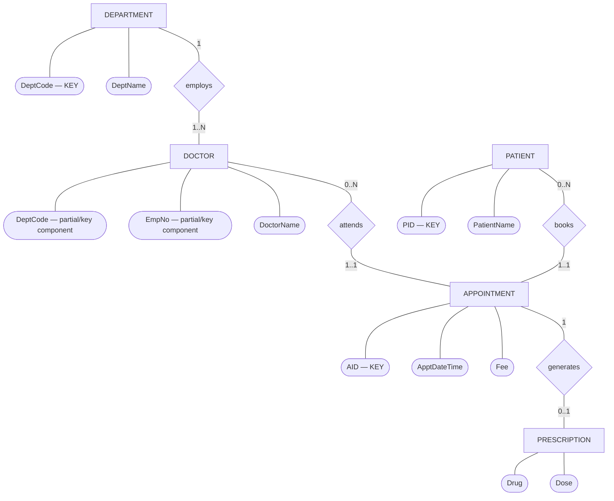
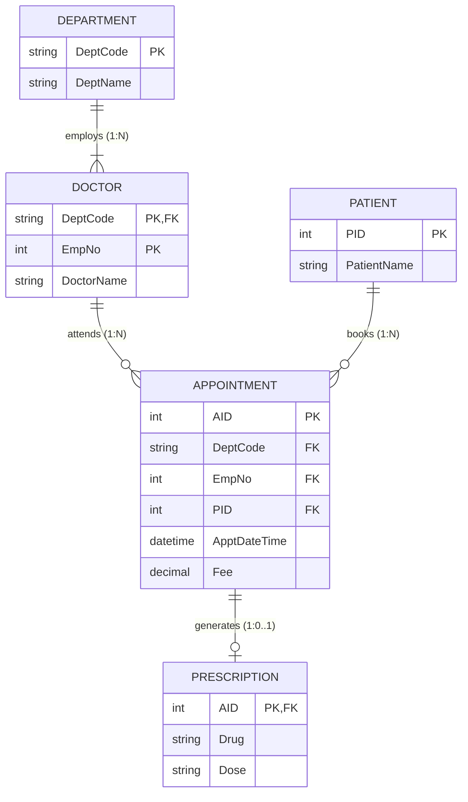

# ER Diagram & Relational Schema — Mock Test 2 (Hospital)

This file shows **both representations of the same database**:

1. **ER Diagram (conceptual model)** — entities, attributes, relationships, cardinalities.
2. **Relational Schema (logical/table model)** — tables, primary keys, foreign keys, and constraints.

> Note: Mermaid's built-in `erDiagram` uses Crow's Foot notation rather than classic Chen ovals/diamonds.  
> The first diagram below therefore uses a Mermaid `flowchart` to imitate **Chen notation**.

---

# 1. ER Diagram — Chen-Style

### Meaning

- **Department & Doctor (`employs`):** One **DEPARTMENT** employs one or more **DOCTORs** ($1:N$). Each doctor belongs to exactly one department; employee numbers are scoped within a department.
- **Doctor & Appointment (`attends`):** One **DOCTOR** attends zero or more **APPOINTMENTs** ($1:N$). Each appointment is attended by exactly one doctor.
- **Patient & Appointment (`books`):** One **PATIENT** books zero or more **APPOINTMENTs** ($1:N$). Each appointment is booked by exactly one patient.
- **Appointment Constraints:** An appointment is between exactly one doctor and one patient at a specific date-time. A doctor cannot have two appointments at the same date-time (enforced by candidate key `(DeptCode, EmpNo, ApptDateTime)`).
- **Appointment & Prescription (`generates`):** An **APPOINTMENT** optionally generates at most one **PRESCRIPTION** ($1:0..1$). A prescription belongs to exactly one appointment.

---

# 2. Relational Schema — Tables, PKs and FKs

## Relational notation

### DEPARTMENT

**DEPARTMENT**(`DeptCode`, DeptName)

- **PK:** `DeptCode`

### DOCTOR

**DOCTOR**(`DeptCode`, `EmpNo`, DoctorName)

- **PK:** (`DeptCode`, `EmpNo`)
- **FK:** `DeptCode` → `DEPARTMENT(DeptCode)`
- `ON DELETE CASCADE`

### PATIENT

**PATIENT**(`PID`, PatientName)

- **PK:** `PID`

### APPOINTMENT

**APPOINTMENT**(`AID`, DeptCode, EmpNo, PID, ApptDateTime, Fee)

- **PK:** `AID`
- **FK:** (`DeptCode`, `EmpNo`) → `DOCTOR(DeptCode, EmpNo)` (`NOT NULL`)
- **FK:** `PID` → `PATIENT(PID)` (`NOT NULL`)
- **UNIQUE:** (`DeptCode`, `EmpNo`, `ApptDateTime`)
  - Prevents a doctor from being double-booked at the same time.

### PRESCRIPTION

**PRESCRIPTION**(`AID`, Drug, Dose)

- **PK:** `AID`
- **FK:** `AID` → `APPOINTMENT(AID)`
- `ON DELETE CASCADE`

---

# Quick Exam Distinction

| ER Diagram | Relational Schema |
|---|---|
| Conceptual design | Logical/table design |
| Entity → rectangle | Relation → table |
| Attribute → oval | Attribute → column |
| Relationship → diamond | Relationship → foreign key |
| Shows 1:1, 1:N, M:N | Shows PK/FK references |
| Used before conversion | Result after ER-to-relational mapping |

**Memory rule:**

> **ER diagram:** What entities exist and how are they related?  
> **Relational schema:** What tables do I create, and what are their PKs/FKs?
