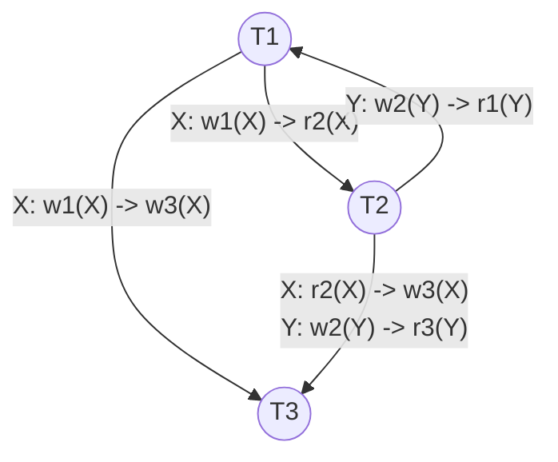
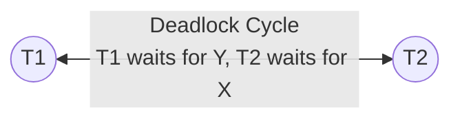

# Mock Test 2 — Precedence Graph & Concurrency Solution

## Question 4: Serialization & Concurrency
Given schedule $S$:
$$S = w_1(X)\ r_2(X)\ w_2(Y)\ r_3(Y)\ w_3(X)\ r_1(Y)$$

---

## 1. Conflict Analysis & Precedence Graph

### Conflicting Operations Breakdown

| Data Item | Preceding Op | Succeeding Op | Edge Direction | Conflict Type | Rationale |
| :---: | :---: | :---: | :---: | :---: | :--- |
| **X** | $w_1(X)$ | $r_2(X)$ | $T_1 \to T_2$ | **RAW** (Read-After-Write) | $T_2$ reads $X$ written by $T_1$ |
| **X** | $w_1(X)$ | $w_3(X)$ | $T_1 \to T_3$ | **WAW** (Write-After-Write) | $T_1$ writes $X$ before $T_3$ writes $X$ |
| **X** | $r_2(X)$ | $w_3(X)$ | $T_2 \to T_3$ | **WAR** (Write-After-Read) | $T_2$ reads $X$ before $T_3$ overwrites $X$ |
| **Y** | $w_2(Y)$ | $r_3(Y)$ | $T_2 \to T_3$ | **RAW** (Read-After-Write) | $T_3$ reads $Y$ written by $T_2$ |
| **Y** | $w_2(Y)$ | $r_1(Y)$ | $T_2 \to T_1$ | **RAW** (Read-After-Write) | $T_1$ reads $Y$ written by $T_2$ |

---

### Precedence Graph $P(S)$

---

## 2. Conflict Serializability Test

- **Cycle Identification:**
  - Cycle: $T_1 \xrightarrow{\text{X}} T_2 \xrightarrow{\text{Y}} T_1$ (Length 2 cycle $T_1 \leftrightarrow T_2$)

- **Conclusion:**
  > [!IMPORTANT]
  > Schedule $S$ is **NOT conflict-serializable** because its precedence graph contains a directed cycle between $T_1$ and $T_2$.

---

## 3. Recoverability & Cascadelessness

- **Commit Order:** $c_1 \to c_2 \to c_3$
- **Read-From Dependencies:**
  - $T_2$ reads $X$ from $T_1$ $\implies T_2$ depends on $T_1$ (requires $c_1 < c_2$).
  - $T_3$ reads $Y$ from $T_2$ $\implies T_3$ depends on $T_2$ (requires $c_2 < c_3$).
  - $T_1$ reads $Y$ from $T_2$ $\implies T_1$ depends on $T_2$ (requires $c_2 < c_1$).

- **Evaluation:**
  - The dependency $T_1$ reads from $T_2$ requires $T_2$ to commit before $T_1$ ($c_2 < c_1$).
  - However, the actual commit order is $c_1 < c_2$. Thus $T_1$ commits **before** $T_2$ commits after reading $T_2$'s uncommitted write $w_2(Y)$.

> [!WARNING]
> - **Recoverable:** **No**, because $T_1$ reads $Y$ written by $T_2$ and commits before $T_2$.
> - **Cascadeless:** **No**, because $T_2, T_3, T_1$ all read uncommitted data from active transactions.

---

## 4. 2PL Deadlock Analysis & Wait-For Graph

### Scenario Setup
Under Basic 2PL, if:
- $T_1$ locks $X$ ($X(X)$) then requests lock on $Y$ ($X(Y)$ or $S(Y)$)
- $T_2$ locks $Y$ ($X(Y)$) then requests lock on $X$ ($X(X)$ or $S(X)$)

### Wait-For Graph (WFG)

### Deadlock Resolution Policy
1. **Detection:** Periodically construct the Wait-For Graph (WFG) and run cycle detection (e.g., Tarjan's algorithm or DFS).
2. **Victim Selection:** Choose a transaction to abort (e.g., the youngest transaction, transaction with fewest locks held, or lowest cost to rollback).
3. **Rollback & Restart:** Abort the chosen victim, release all its held locks (waking up blocked transactions), and restart it later.
