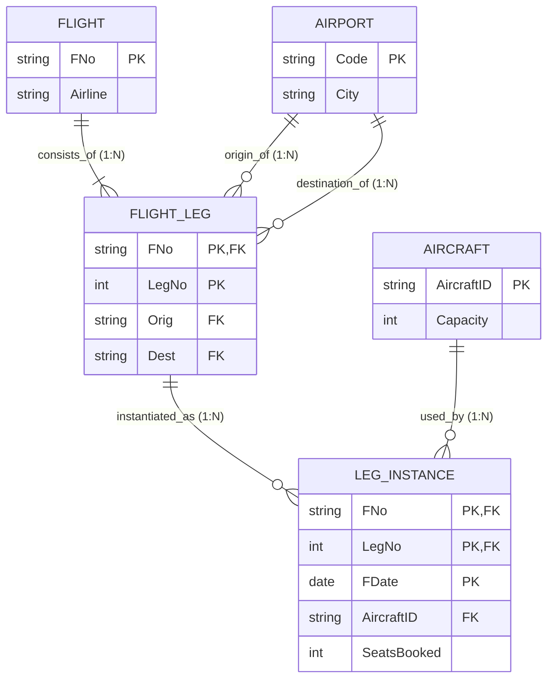

# Mock Test 3 — ER Diagram & Relational Schema

---

## 1. Relationship Cardinality Breakdown

| Relationship | Entity 1 (Card / Part) | Entity 2 (Card / Part) | Ratio | Design / Mapping Semantics |
| :--- | :--- | :--- | :--- | :--- |
| **consists_of** | `FLIGHT` (1, total: 1..N) | `FLIGHT_LEG` (N, total: 1..1) | **1 : N** | A flight consists of **1 or more** legs. Each flight leg belongs to **exactly 1** flight (`FNo` in PK). |
| **origin_of** | `AIRPORT` (1, partial: 0..N) | `FLIGHT_LEG` (N, total: 1..1) | **1 : N** | An airport is origin for **0..N** legs. Each leg departs from **exactly 1** origin airport (`Orig` FK). |
| **destination_of** | `AIRPORT` (1, partial: 0..N) | `FLIGHT_LEG` (N, total: 1..1) | **1 : N** | An airport is destination for **0..N** legs. Each leg arrives at **exactly 1** destination airport (`Dest` FK). |
| **instantiated_as**| `FLIGHT_LEG` (1, partial: 0..N) | `LEG_INSTANCE` (N, total: 1..1) | **1 : N** | A leg is flown on **0..N** dates. Each leg instance corresponds to **exactly 1** flight leg (`FNo, LegNo` in PK). |
| **used_by** | `AIRCRAFT` (1, partial: 0..N) | `LEG_INSTANCE` (N, total: 1..1) | **1 : N** | An aircraft is assigned to **0..N** leg instances. Each instance uses **exactly 1** assigned aircraft (`AircraftID` FK). |

---

## 2. Relational Schema

- **`FLIGHT`** (**`FNo`**, `Airline`)
  - **PK:** `FNo`

- **`AIRPORT`** (**`Code`**, `City`)
  - **PK:** `Code`

- **`AIRCRAFT`** (**`AircraftID`**, `Capacity`)
  - **PK:** `AircraftID`

- **`FLIGHT_LEG`** (**`FNo`**, **`LegNo`**, `Orig`, `Dest`)
  - **PK:** `(FNo, LegNo)`
  - **FK:** `FNo` $\to$ `FLIGHT(FNo)` (ON DELETE CASCADE)
  - **FK:** `Orig` $\to$ `AIRPORT(Code)` (`NOT NULL`)
  - **FK:** `Dest` $\to$ `AIRPORT(Code)` (`NOT NULL`)
  - **CHECK:** `Orig <> Dest` *(Origin and destination airports must differ)*

- **`LEG_INSTANCE`** (**`FNo`**, **`LegNo`**, **`FDate`**, `AircraftID`, `SeatsBooked`)
  - **PK:** `(FNo, LegNo, FDate)`
  - **FK:** `(FNo, LegNo)` $\to$ `FLIGHT_LEG(FNo, LegNo)` (ON DELETE CASCADE)
  - **FK:** `AircraftID` $\to$ `AIRCRAFT(AircraftID)` (`NOT NULL`)

---

## 3. Key Notes & Constraints
- **Multilevel Weak Entities:** `FLIGHT_LEG` is weak under `FLIGHT` (identified by `(FNo, LegNo)`). `LEG_INSTANCE` is weak under `FLIGHT_LEG` (identified by `(FNo, LegNo, FDate)`).
- **Multiple References to Same Relation:** `FLIGHT_LEG` has two distinct foreign keys (`Orig` and `Dest`) referencing `AIRPORT(Code)`.

