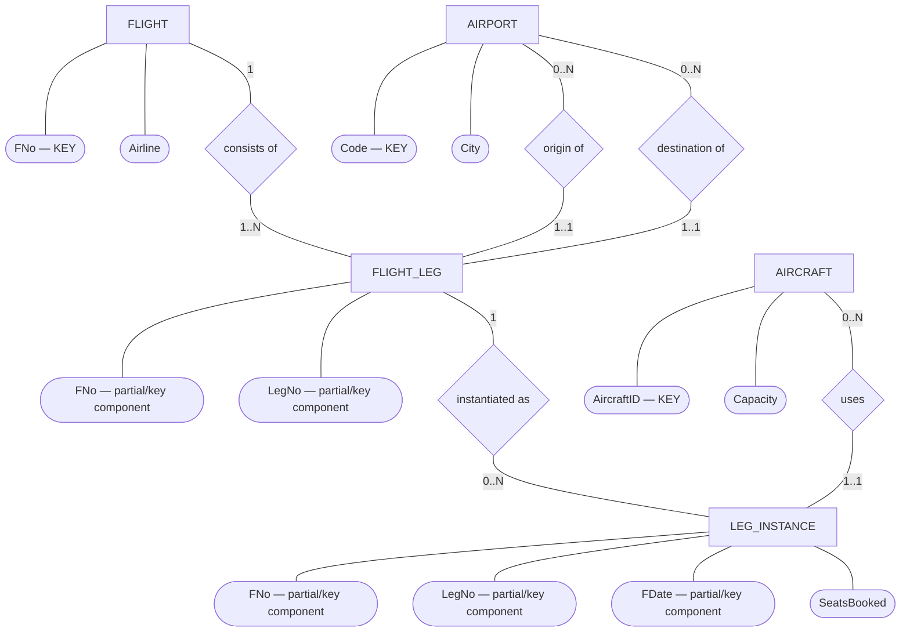
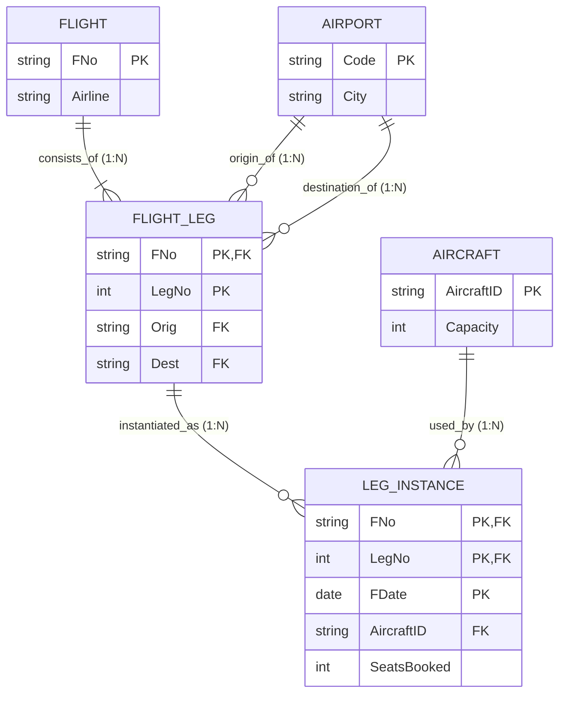

# ER Diagram & Relational Schema — Mock Test 3 (Airline Flight System)

This file shows **both representations of the same database**:

1. **ER Diagram (conceptual model)** — entities, attributes, relationships, cardinalities.
2. **Relational Schema (logical/table model)** — tables, primary keys, foreign keys, and constraints.

> Note: Mermaid's built-in `erDiagram` uses Crow's Foot notation rather than classic Chen ovals/diamonds.  
> The first diagram below therefore uses a Mermaid `flowchart` to imitate **Chen notation**.

---

# 1. ER Diagram — Chen-Style

### Meaning

- **Flight & FlightLeg (`consists of`):** One **FLIGHT** consists of one or more **FLIGHT_LEG**s ($1:N$, total participation on `FLIGHT_LEG`). `FLIGHT_LEG` is existence-dependent on `FLIGHT`; leg numbers `1, 2, 3, ...` are scoped per flight.
- **Airport & FlightLeg (`origin of` & `destination of`):** Each **FLIGHT_LEG** has **exactly one** origin airport and **exactly one** destination airport ($1:N$ each). An **AIRPORT** can serve as the origin or destination for zero or more legs.
- **FlightLeg & LegInstance (`instantiated as`):** A **FLIGHT_LEG** is flown on specific dates as zero or more **LEG_INSTANCE**s ($1:N$). `LEG_INSTANCE` is existence-dependent on `FLIGHT_LEG`; identified by `(FNo, LegNo, FDate)`.
- **Aircraft & LegInstance (`uses`):** Each **LEG_INSTANCE** uses **exactly one** assigned **AIRCRAFT** ($1:N$). An aircraft can be used by zero or more leg instances across time.

---

# 2. Relational Schema — Tables, PKs and FKs

## Relational notation

### FLIGHT

**FLIGHT**(`FNo`, Airline)

- **PK:** `FNo`

### AIRPORT

**AIRPORT**(`Code`, City)

- **PK:** `Code`

### AIRCRAFT

**AIRCRAFT**(`AircraftID`, Capacity)

- **PK:** `AircraftID`

### FLIGHT_LEG

**FLIGHT_LEG**(`FNo`, `LegNo`, Orig, Dest)

- **PK:** (`FNo`, `LegNo`)
- **FK:** `FNo` → `FLIGHT(FNo)`
- `ON DELETE CASCADE`
- **FK:** `Orig` → `AIRPORT(Code)`
- `NOT NULL`
- **FK:** `Dest` → `AIRPORT(Code)`
- `NOT NULL`
- **CHECK:** `Orig <> Dest`
  - Origin and destination airports must differ.

### LEG_INSTANCE

**LEG_INSTANCE**(`FNo`, `LegNo`, `FDate`, AircraftID, SeatsBooked)

- **PK:** (`FNo`, `LegNo`, `FDate`)
- **FK:** (`FNo`, `LegNo`) → `FLIGHT_LEG(FNo, LegNo)`
- `ON DELETE CASCADE`
- **FK:** `AircraftID` → `AIRCRAFT(AircraftID)`
- `NOT NULL`

---

# Quick Exam Distinction

| ER Diagram | Relational Schema |
|---|---|
| Conceptual design | Logical/table design |
| Entity → rectangle | Relation → table |
| Attribute → oval | Attribute → column |
| Relationship → diamond | Relationship → foreign key |
| Shows 1:1, 1:N, M:N | Shows PK/FK references |
| Used before conversion | Result after ER-to-relational mapping |

**Memory rule:**

> **ER diagram:** What entities exist and how are they related?  
> **Relational schema:** What tables do I create, and what are their PKs/FKs?
