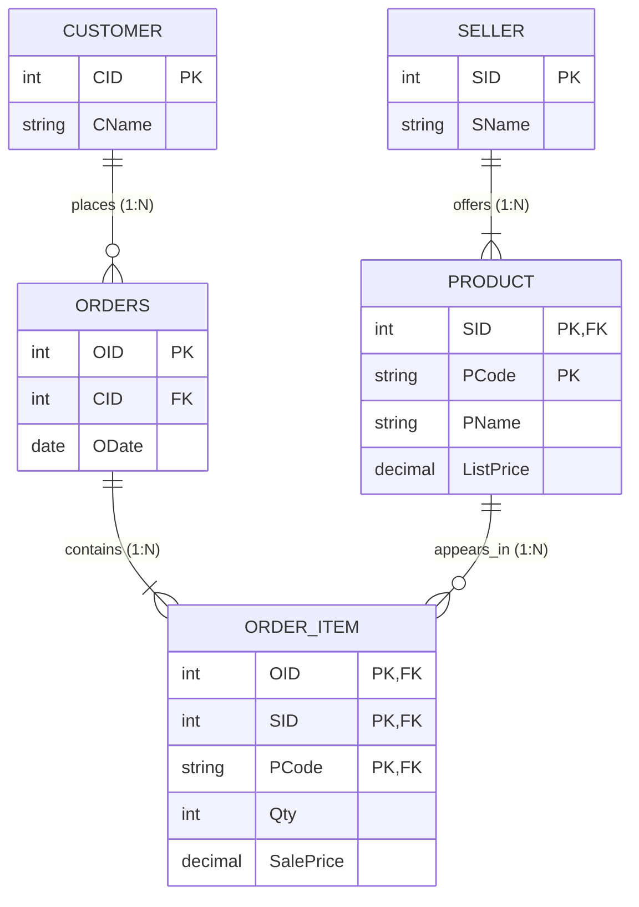

# Mock Test 4 — ER Diagram & Relational Schema

---

## 1. Relationship Cardinality Breakdown

| Relationship | Entity 1 (Card / Part) | Entity 2 (Card / Part) | Ratio | Design / Mapping Semantics |
| :--- | :--- | :--- | :--- | :--- |
| **offers** | `SELLER` (1, total: 1..N) | `PRODUCT` (N, total: 1..1) | **1 : N** | A seller offers **1 or more** products. Each product belongs to **exactly 1** seller (`SID` in PK). |
| **places** | `CUSTOMER` (1, partial: 0..N) | `ORDERS` (N, total: 1..1) | **1 : N** | A customer places **0..N** orders. Each order is placed by **exactly 1** customer (`CID` FK). |
| **contains** | `ORDERS` (1, total: 1..N) | `ORDER_ITEM` (N, total: 1..1) | **1 : N** | An order contains **1 or more** order line items. Each order item belongs to **exactly 1** order (`OID` in PK). |
| **appears_in** | `PRODUCT` (1, partial: 0..N) | `ORDER_ITEM` (N, total: 1..1) | **1 : N** | A product appears in **0..N** order line items. Each line item references **exactly 1** product (`SID, PCode` in PK). |

---

## 2. Relational Schema

- **`SELLER`** (**`SID`**, `SName`)
  - **PK:** `SID`

- **`PRODUCT`** (**`SID`**, **`PCode`**, `PName`, `ListPrice`)
  - **PK:** `(SID, PCode)`
  - **FK:** `SID` $\to$ `SELLER(SID)` (ON DELETE CASCADE)

- **`CUSTOMER`** (**`CID`**, `CName`)
  - **PK:** `CID`

- **`ORDERS`** (**`OID`**, `CID`, `ODate`)
  - **PK:** `OID`
  - **FK:** `CID` $\to$ `CUSTOMER(CID)` (`NOT NULL`)

- **`ORDER_ITEM`** (**`OID`**, **`SID`**, **`PCode`**, `Qty`, `SalePrice`)
  - **PK:** `(OID, SID, PCode)`
  - **FK:** `OID` $\to$ `ORDERS(OID)` (ON DELETE CASCADE)
  - **FK:** `(SID, PCode)` $\to$ `PRODUCT(SID, PCode)` (ON DELETE RESTRICT)

---

## 3. Key Notes & Constraints
- **Composite Primary Key Propagation:** `PRODUCT` has key `(SID, PCode)` because product codes are assigned locally per seller.
- **Associative Entity (`ORDER_ITEM`):** `ORDER_ITEM` represents the $M:N$ relationship between `ORDERS` and `PRODUCT`. Its primary key is the combination of the order key and product key: `(OID, SID, PCode)`.

