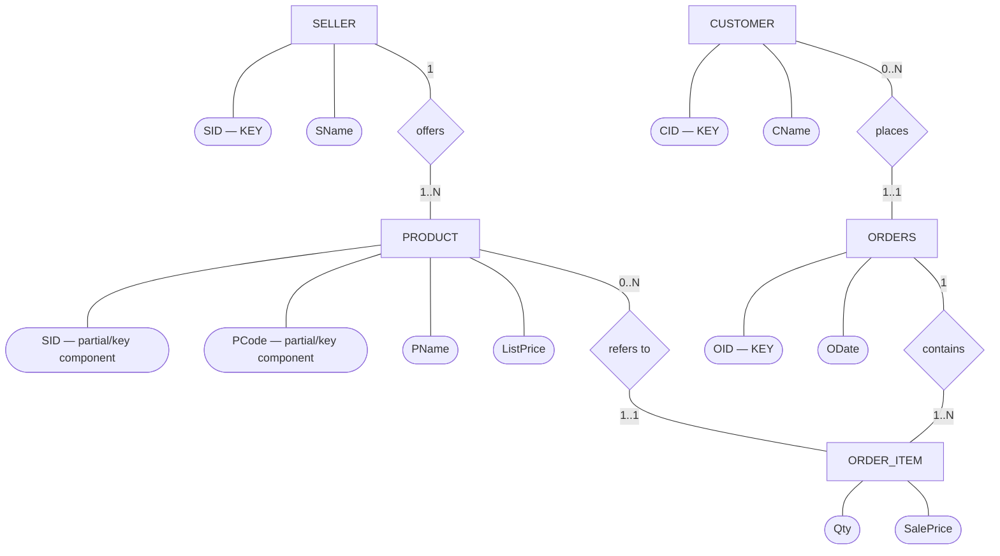
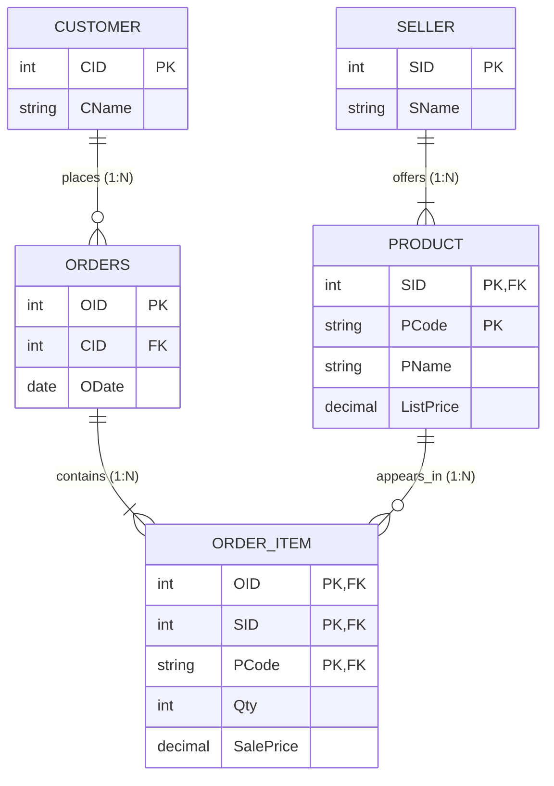

# ER Diagram & Relational Schema — Mock Test 4 (E-Commerce Marketplace)

This file shows **both representations of the same database**:

1. **ER Diagram (conceptual model)** — entities, attributes, relationships, cardinalities.
2. **Relational Schema (logical/table model)** — tables, primary keys, foreign keys, and constraints.

> Note: Mermaid's built-in `erDiagram` uses Crow's Foot notation rather than classic Chen ovals/diamonds.  
> The first diagram below therefore uses a Mermaid `flowchart` to imitate **Chen notation**.

---

# 1. ER Diagram — Chen-Style

### Meaning

- **Seller & Product (`offers`):** One **SELLER** offers one or more **PRODUCTs** ($1:N$, total participation on `PRODUCT`). A product code `PCode` is unique only within a seller (`PRODUCT` is weak/scoped under `SELLER`).
- **Customer & Orders (`places`):** One **CUSTOMER** places zero or more **ORDERS** ($1:N$). Each order belongs to **exactly one** customer.
- **Orders & OrderItem (`contains`):** One **ORDERS** contains one or more **ORDER_ITEMs** ($1:N$, total participation on `ORDER_ITEM`). Each item belongs to **exactly one** order.
- **Product & OrderItem (`refers to`):** Each **ORDER_ITEM** references **exactly one** product offered by a seller ($1:N$).
- **No Duplicate Products per Order:** The same product cannot appear twice in one order, meaning the primary key of `ORDER_ITEM` is `(OID, SID, PCode)`.

---

# 2. Relational Schema — Tables, PKs and FKs

## Relational notation

### SELLER

**SELLER**(`SID`, SName)

- **PK:** `SID`

### PRODUCT

**PRODUCT**(`SID`, `PCode`, PName, ListPrice)

- **PK:** (`SID`, `PCode`)
- **FK:** `SID` → `SELLER(SID)`
- `ON DELETE CASCADE`

### CUSTOMER

**CUSTOMER**(`CID`, CName)

- **PK:** `CID`

### ORDERS

**ORDERS**(`OID`, CID, ODate)

- **PK:** `OID`
- **FK:** `CID` → `CUSTOMER(CID)`
- `NOT NULL`

### ORDER_ITEM

**ORDER_ITEM**(`OID`, `SID`, `PCode`, Qty, SalePrice)

- **PK:** (`OID`, `SID`, `PCode`)
- **FK:** `OID` → `ORDERS(OID)`
- `ON DELETE CASCADE`
- **FK:** (`SID`, `PCode`) → `PRODUCT(SID, PCode)`
- `ON DELETE RESTRICT`
- **CHECK:** `Qty > 0`
- **CHECK:** `SalePrice >= 0`

---

# Quick Exam Distinction

| ER Diagram | Relational Schema |
|---|---|
| Conceptual design | Logical/table design |
| Entity → rectangle | Relation → table |
| Attribute → oval | Attribute → column |
| Relationship → diamond | Relationship → foreign key |
| Shows 1:1, 1:N, M:N | Shows PK/FK references |
| Used before conversion | Result after ER-to-relational mapping |

**Memory rule:**

> **ER diagram:** What entities exist and how are they related?  
> **Relational schema:** What tables do I create, and what are their PKs/FKs?
