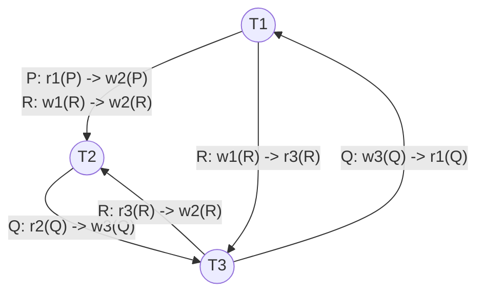

# Mock Test 4 — Precedence Graph & Concurrency Solution

## Question 4: Serialization & Concurrency
Given schedule $S$:
$$S = r_1(P)\ w_2(P)\ r_2(Q)\ w_3(Q)\ r_1(Q)\ w_1(R)\ r_3(R)\ w_2(R)$$

---

## 1. Conflict Analysis & Precedence Graph

### Conflicting Operations Breakdown

| Data Item | Preceding Op | Succeeding Op | Edge Direction | Conflict Type | Rationale |
| :---: | :---: | :---: | :---: | :---: | :--- |
| **P** | $r_1(P)$ | $w_2(P)$ | $T_1 \to T_2$ | **WAR** (Write-After-Read) | $T_1$ reads $P$ before $T_2$ overwrites $P$ |
| **Q** | $r_2(Q)$ | $w_3(Q)$ | $T_2 \to T_3$ | **WAR** (Write-After-Read) | $T_2$ reads $Q$ before $T_3$ overwrites $Q$ |
| **Q** | $w_3(Q)$ | $r_1(Q)$ | $T_3 \to T_1$ | **RAW** (Read-After-Write) | $T_1$ reads $Q$ written by $T_3$ |
| **R** | $w_1(R)$ | $r_3(R)$ | $T_1 \to T_3$ | **RAW** (Read-After-Write) | $T_3$ reads $R$ written by $T_1$ |
| **R** | $w_1(R)$ | $w_2(R)$ | $T_1 \to T_2$ | **WAW** (Write-After-Write) | $T_1$ writes $R$ before $T_2$ writes $R$ |
| **R** | $r_3(R)$ | $w_2(R)$ | $T_3 \to T_2$ | **WAR** (Write-After-Read) | $T_3$ reads $R$ before $T_2$ overwrites $R$ |

---

### Precedence Graph $P(S)$

---

## 2. Conflict Serializability Test

- **Cycles Identified:**
  - Cycle 1: $T_1 \xrightarrow{\text{P}} T_2 \xrightarrow{\text{Q}} T_3 \xrightarrow{\text{Q}} T_1$ (Length 3)
  - Cycle 2: $T_2 \xrightarrow{\text{Q}} T_3 \xrightarrow{\text{R}} T_2$ (Length 2)
  - Cycle 3: $T_1 \xrightarrow{\text{R}} T_3 \xrightarrow{\text{Q}} T_1$ (Length 2)

- **Conclusion:**
  > [!IMPORTANT]
  > Schedule $S$ is **NOT conflict-serializable** because its precedence graph contains multiple cycles.

---

## 3. Recoverability & Cascadelessness

- **Dependency:** $T_1$ reads $Q$ written by $T_3$ ($w_3(Q) \to r_1(Q)$) $\implies T_1$ depends on $T_3$.
- **Commit Order:** $c_1 \to c_3 \to c_2$

- **Evaluation:**
  - Recoverability requires that $T_3$ (the writer) commits **before** $T_1$ (the reader) commits ($c_3 < c_1$).
  - However, $c_1 < c_3$ ($T_1$ commits first). If $T_3$ aborts later, $T_1$ committed reading invalid uncommitted data.

> [!WARNING]
> - **Recoverable:** **No**, because $T_1$ reads from $T_3$ but commits ($c_1$) before $T_3$ ($c_3$).
> - **Cascadeless:** **No**, because $T_1$ reads an uncommitted value from $T_3$.

---

## 4. Deadlock Prevention: Wait-Die vs Wound-Wait

Both schemes assign timestamps $TS(T_i)$ when transactions start (smaller timestamp = older transaction).

| Mechanism | Requesting $T_i$ vs Holding $T_j$ | Action | Key Characteristic |
| :--- | :--- | :--- | :--- |
| **Wait-Die** | $TS(T_i) < TS(T_j)$ (Older requests younger) | **WAIT** | Non-preemptive (Older waits for younger) |
| **Wait-Die** | $TS(T_i) > TS(T_j)$ (Younger requests older) | **DIE** (Aborts $T_i$) | Younger dies when requesting older |
| **Wound-Wait** | $TS(T_i) < TS(T_j)$ (Older requests younger) | **WOUND** (Aborts $T_j$) | Preemptive (Older preempts/wounds younger) |
| **Wound-Wait** | $TS(T_i) > TS(T_j)$ (Younger requests older) | **WAIT** | Younger waits for older |

- **Why Deadlocks Are Prevented:** Both protocols enforce a strictly monotonic direction for waiting based on timestamps (either only older waits for younger, or only younger waits for older), ensuring that wait-for cycles can never form.
