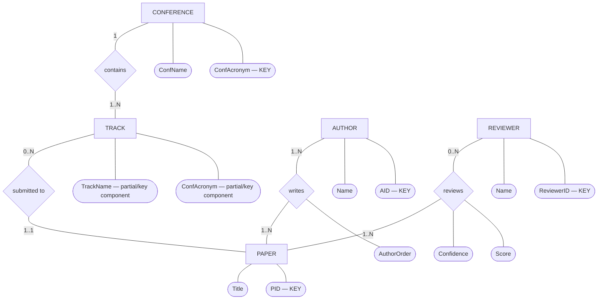
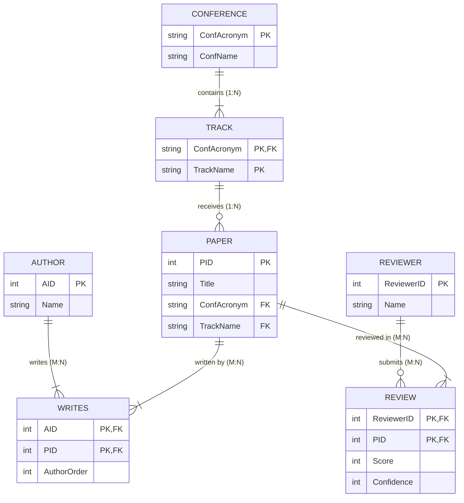

# ER Diagram & Relational Schema — Mock Test 5 (Research Conference)

This file shows **both representations of the same database**:

1. **ER Diagram (conceptual model)** — entities, attributes, relationships, cardinalities.
2. **Relational Schema (logical/table model)** — tables, primary keys, foreign keys, and constraints.

> Note: Mermaid's built-in `erDiagram` uses Crow's Foot notation rather than classic Chen ovals/diamonds.  
> The first diagram below therefore uses a Mermaid `flowchart` to imitate **Chen notation**.

---

# 1. ER Diagram — Chen-Style

### Meaning

- **Conference & Track (`contains`):** One **CONFERENCE** contains one or more **TRACKs** ($1:N$, total participation on `TRACK`). Track names are unique only within a conference (`TRACK` is weak/scoped under `CONFERENCE`).
- **Track & Paper (`submitted to`):** Each **TRACK** receives zero or more **PAPERs** ($1:N$). Each paper is submitted to **exactly one** track.
- **Author & Paper (`writes`):** An **AUTHOR** writes one or more **PAPERs**, and a **PAPER** has one or more **AUTHORs** ($M:N$). Each authorship specifies an `AuthorOrder`.
- **Reviewer & Paper (`reviews`):** A **REVIEWER** reviews zero or more **PAPERs**, and each **PAPER** receives reviews from multiple reviewers ($M:N$). Each review record stores `Score` and `Confidence`.

---

# 2. Relational Schema — Tables, PKs and FKs

## Relational notation

### CONFERENCE

**CONFERENCE**(`ConfAcronym`, ConfName)

- **PK:** `ConfAcronym`

### TRACK

**TRACK**(`ConfAcronym`, `TrackName`)

- **PK:** (`ConfAcronym`, `TrackName`)
- **FK:** `ConfAcronym` → `CONFERENCE(ConfAcronym)`
- `ON DELETE CASCADE`

### PAPER

**PAPER**(`PID`, Title, ConfAcronym, TrackName)

- **PK:** `PID`
- **FK:** (`ConfAcronym`, `TrackName`) → `TRACK(ConfAcronym, TrackName)`
- `NOT NULL`

### AUTHOR

**AUTHOR**(`AID`, Name)

- **PK:** `AID`

### WRITES

**WRITES**(`AID`, `PID`, AuthorOrder)

- **PK:** (`AID`, `PID`)
- **FK:** `AID` → `AUTHOR(AID)`
- `ON DELETE CASCADE`
- **FK:** `PID` → `PAPER(PID)`
- `ON DELETE CASCADE`
- **UNIQUE:** (`PID`, `AuthorOrder`)
  - Ensures no two authors share the same authorship position on a paper.

### REVIEWER

**REVIEWER**(`ReviewerID`, Name)

- **PK:** `ReviewerID`

### REVIEW

**REVIEW**(`ReviewerID`, `PID`, Score, Confidence)

- **PK:** (`ReviewerID`, `PID`)
- **FK:** `ReviewerID` → `REVIEWER(ReviewerID)`
- `ON DELETE CASCADE`
- **FK:** `PID` → `PAPER(PID)`
- `ON DELETE CASCADE`
- **CHECK:** `Score BETWEEN 1 AND 5`
- **CHECK:** `Confidence BETWEEN 1 AND 3`

---

# Quick Exam Distinction

| ER Diagram | Relational Schema |
|---|---|
| Conceptual design | Logical/table design |
| Entity → rectangle | Relation → table |
| Attribute → oval | Attribute → column |
| Relationship → diamond | Relationship → foreign key |
| Shows 1:1, 1:N, M:N | Shows PK/FK references |
| Used before conversion | Result after ER-to-relational mapping |

**Memory rule:**

> **ER diagram:** What entities exist and how are they related?  
> **Relational schema:** What tables do I create, and what are their PKs/FKs?
