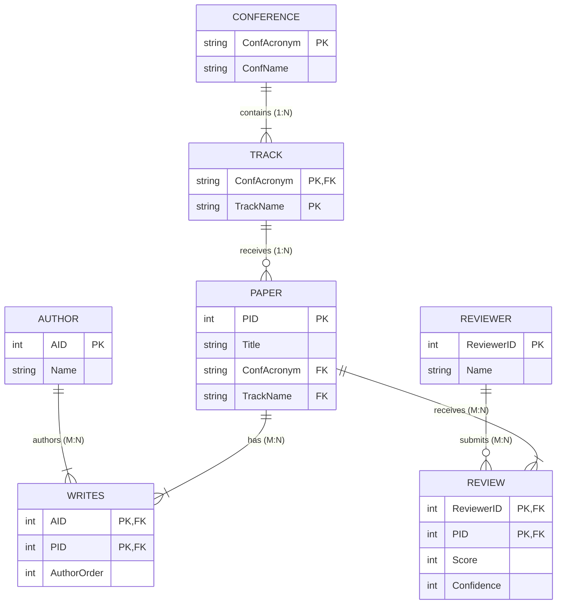

# Mock Test 5 — ER Diagram & Relational Schema

---

## 1. Relationship Cardinality Breakdown

| Relationship | Entity 1 (Card / Part) | Entity 2 (Card / Part) | Ratio | Design / Mapping Semantics |
| :--- | :--- | :--- | :--- | :--- |
| **contains** | `CONFERENCE` (1, total: 1..N) | `TRACK` (N, total: 1..1) | **1 : N** | A conference contains **1 or more** tracks. Each track belongs to **exactly 1** conference (`ConfAcronym` in PK). |
| **receives** | `TRACK` (1, partial: 0..N) | `PAPER` (N, total: 1..1) | **1 : N** | A track receives **0..N** paper submissions. Each paper is submitted to **exactly 1** track (`ConfAcronym, TrackName` FK). |
| **authors / WRITES** | `AUTHOR` (M, total: 1..N) | `PAPER` (N, total: 1..N) | **M : N** | An author writes **1 or more** papers. A paper has **1 or more** co-authors. Junction table `WRITES(AID, PID)` carries `AuthorOrder`. |
| **submits / REVIEW** | `REVIEWER` (M, partial: 0..N) | `PAPER` (N, total: 1..N) | **M : N** | A reviewer submits **0..N** reviews. A paper receives **1 or more** reviews. Junction table `REVIEW(ReviewerID, PID)` carries scores. |

---

## 2. Relational Schema

- **`CONFERENCE`** (**`ConfAcronym`**, `ConfName`)
  - **PK:** `ConfAcronym`

- **`TRACK`** (**`ConfAcronym`**, **`TrackName`**)
  - **PK:** `(ConfAcronym, TrackName)`
  - **FK:** `ConfAcronym` $\to$ `CONFERENCE(ConfAcronym)` (ON DELETE CASCADE)

- **`PAPER`** (**`PID`**, `Title`, `ConfAcronym`, `TrackName`)
  - **PK:** `PID`
  - **FK:** `(ConfAcronym, TrackName)` $\to$ `TRACK(ConfAcronym, TrackName)` (`NOT NULL`)

- **`AUTHOR`** (**`AID`**, `Name`)
  - **PK:** `AID`

- **`WRITES`** (**`AID`**, **`PID`**, `AuthorOrder`) *(Associative relation for M:N authorship)*
  - **PK:** `(AID, PID)`
  - **UNIQUE:** `(PID, AuthorOrder)` *(Constraint: no two authors share the same position order on a paper)*
  - **FK:** `AID` $\to$ `AUTHOR(AID)` (ON DELETE CASCADE)
  - **FK:** `PID` $\to$ `PAPER(PID)` (ON DELETE CASCADE)

- **`REVIEWER`** (**`ReviewerID`**, `Name`)
  - **PK:** `ReviewerID`

- **`REVIEW`** (**`ReviewerID`**, **`PID`**, `Score`, `Confidence`) *(Associative relation for M:N peer-review)*
  - **PK:** `(ReviewerID, PID)`
  - **FK:** `ReviewerID` $\to$ `REVIEWER(ReviewerID)` (ON DELETE CASCADE)
  - **FK:** `PID` $\to$ `PAPER(PID)` (ON DELETE CASCADE)

---

## 3. Key Notes & Constraints
- **Scoped Key:** `TRACK` has key `(ConfAcronym, TrackName)`.
- **M:N Junction Tables:** `WRITES` and `REVIEW` map $M:N$ relationships.
- **Participation Bounds:** Total participation of `PAPER` in `WRITES` means every paper must have at least one author record in `WRITES`. Total participation of `PAPER` in `REVIEW` means every published paper must have review records.

