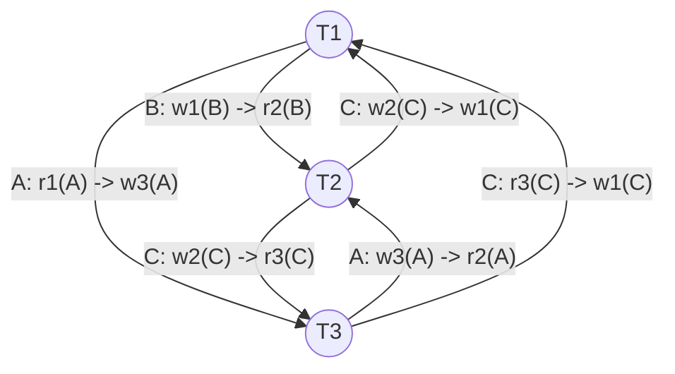

# Mock Test 5 — Precedence Graph & Concurrency Solution

## Question 4: Serialization & Concurrency
Given schedule $S$:
$$S = r_1(A)\ w_1(B)\ r_2(B)\ w_2(C)\ r_3(C)\ w_3(A)\ r_2(A)\ w_1(C)$$

---

## 1. Conflict Analysis & Precedence Graph

### Conflicting Operations Breakdown

| Data Item | Preceding Op | Succeeding Op | Edge Direction | Conflict Type | Rationale |
| :---: | :---: | :---: | :---: | :---: | :--- |
| **A** | $r_1(A)$ | $w_3(A)$ | $T_1 \to T_3$ | **WAR** (Write-After-Read) | $T_1$ reads $A$ before $T_3$ overwrites $A$ |
| **A** | $w_3(A)$ | $r_2(A)$ | $T_3 \to T_2$ | **RAW** (Read-After-Write) | $T_2$ reads $A$ written by $T_3$ |
| **B** | $w_1(B)$ | $r_2(B)$ | $T_1 \to T_2$ | **RAW** (Read-After-Write) | $T_2$ reads $B$ written by $T_1$ |
| **C** | $w_2(C)$ | $r_3(C)$ | $T_2 \to T_3$ | **RAW** (Read-After-Write) | $T_3$ reads $C$ written by $T_2$ |
| **C** | $w_2(C)$ | $w_1(C)$ | $T_2 \to T_1$ | **WAW** (Write-After-Write) | $T_2$ writes $C$ before $T_1$ writes $C$ |
| **C** | $r_3(C)$ | $w_1(C)$ | $T_3 \to T_1$ | **WAR** (Write-After-Read) | $T_3$ reads $C$ before $T_1$ overwrites $C$ |

---

### Precedence Graph $P(S)$

---

## 2. Conflict Serializability Test

- **Cycles Identified:**
  - Cycle 1: $T_1 \xrightarrow{\text{B}} T_2 \xrightarrow{\text{C}} T_1$ (Length 2)
  - Cycle 2: $T_1 \xrightarrow{\text{A}} T_3 \xrightarrow{\text{C}} T_1$ (Length 2)
  - Cycle 3: $T_2 \xrightarrow{\text{C}} T_3 \xrightarrow{\text{A}} T_2$ (Length 2)
  - Cycle 4: $T_1 \xrightarrow{\text{B}} T_2 \xrightarrow{\text{C}} T_3 \xrightarrow{\text{C}} T_1$ (Length 3)

- **Conclusion:**
  > [!IMPORTANT]
  > Schedule $S$ is **NOT conflict-serializable** because its precedence graph contains multiple cycles.

---

## 3. Recoverability & Cascadelessness

- **Commit Order:** $c_2 \to c_1 \to c_3$
- **Read-From Dependencies:**
  - $T_2$ reads $B$ from $T_1$ ($w_1(B) \to r_2(B)$) $\implies T_2$ depends on $T_1$ (requires $c_1 < c_2$).
  - $T_3$ reads $C$ from $T_2$ ($w_2(C) \to r_3(C)$) $\implies T_3$ depends on $T_2$ (requires $c_2 < c_3$).

- **Evaluation:**
  - For $T_2 \implies T_1$: $T_2$ reads from $T_1$, but $T_2$ commits **before** $T_1$ ($c_2 < c_1$).
  - If $T_1$ aborts later, $T_2$ will have committed based on an uncommitted write.

> [!WARNING]
> - **Recoverable:** **No**, because $T_2$ reads $B$ written by $T_1$ but commits ($c_2$) before $T_1$ ($c_1$).
> - **Cascadeless:** **No**, because $T_2$ and $T_3$ read uncommitted values from active transactions.

---

## 4. Strict 2PL Protocol & Anomalies Prevented

### Lock Holding Rule
Under **Strict Two-Phase Locking (Strict 2PL)**:
- Transactions must obtain a shared lock $S(X)$ before reading and an exclusive lock $X(X)$ before writing.
- **Critical Rule:** All **exclusive (write) locks** held by a transaction must be retained until the transaction fully completes (**commits or aborts**).

### Anomalies Prevented by Strict 2PL
1. **Dirty Reads:** Prevents a transaction from reading uncommitted modifications of another transaction.
2. **Dirty Writes:** Prevents uncommitted writes from being overwritten by another transaction.
3. **Cascading Aborts:** Since transactions cannot read uncommitted data, aborting a transaction will not cause a cascade of aborts across other transactions.
4. **Unrecoverable Schedules:** Enforces recoverability by ensuring dependencies strictly commit in order.
