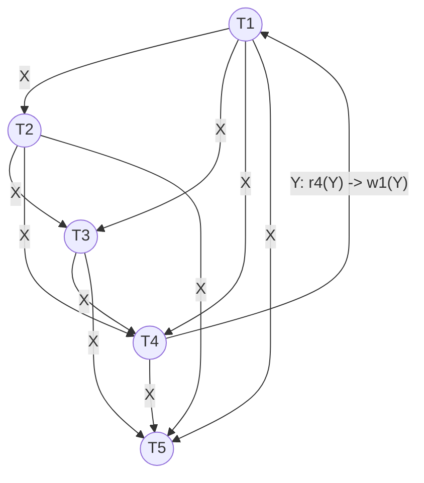

# Sample Test — Precedence Graph Solution

## Question 7: Precedence Graph & Conflict Serializability
Given schedule $S$:
$$S = w_1(X)\ w_2(X)\ w_3(X)\ w_4(X)\ w_5(X)\ r_4(Y)\ w_1(Y)$$

---

## 1. Conflict Analysis & Precedence Graph

### Conflicting Operations Breakdown

| Data Item | Preceding Op | Succeeding Op | Edge Direction | Conflict Type | Rationale |
| :---: | :---: | :---: | :---: | :---: | :--- |
| **X** | $w_1(X)$ | $w_2(X), w_3(X), w_4(X), w_5(X)$ | $T_1 \to T_2, T_3, T_4, T_5$ | **WAW** | $T_1$ writes $X$ before $T_2, T_3, T_4, T_5$ |
| **X** | $w_2(X)$ | $w_3(X), w_4(X), w_5(X)$ | $T_2 \to T_3, T_4, T_5$ | **WAW** | $T_2$ writes $X$ before $T_3, T_4, T_5$ |
| **X** | $w_3(X)$ | $w_4(X), w_5(X)$ | $T_3 \to T_4, T_5$ | **WAW** | $T_3$ writes $X$ before $T_4, T_5$ |
| **X** | $w_4(X)$ | $w_5(X)$ | $T_4 \to T_5$ | **WAW** | $T_4$ writes $X$ before $T_5$ |
| **Y** | $r_4(Y)$ | $w_1(Y)$ | $T_4 \to T_1$ | **WAR** (Write-After-Read) | $T_4$ reads $Y$ before $T_1$ overwrites $Y$ |

---

### Precedence Graph $P(S)$

---

## 2. Conflict Serializability Test

- **Is $S$ conflict-serializable?**
  > [!IMPORTANT]
  > **No**, schedule $S$ is **NOT conflict-serializable** because there is a cycle between $T_1$ and $T_4$ (and through intermediate nodes $T_2, T_3$).

---

## 3. Serial Executions & Cycle Analysis

- **(c.1) How many conflict-equivalent serial executions may $S$ have?**
  - **0 serial executions**, because conflict serializability is a prerequisite for a schedule to have a conflict-equivalent serial execution.

- **(c.2) How many cycles does $P(S)$ have?**
  - **4 cycles in total:**
    1. $T_1 \to T_4 \to T_1$ (Length 2)
    2. $T_1 \to T_2 \to T_4 \to T_1$ (Length 3)
    3. $T_1 \to T_3 \to T_4 \to T_1$ (Length 3)
    4. $T_1 \to T_2 \to T_3 \to T_4 \to T_1$ (Length 4)
