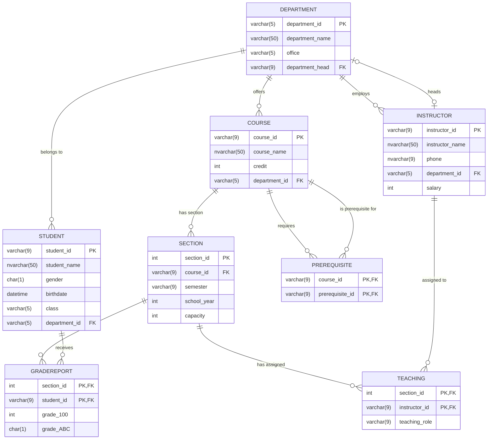

# University Database Schema & Query Explanation

This document provides a visual representation of the database schema defined in [UniversityDB_Script.sql](file:///D:/APCS/Year2_Term3/CS486%20-%20Introduction%20to%20Database%20Systems/Labs/24125093_Lab_3/UniversityDB_Script.sql) and explains the syntax used in [SQLQuery1.sql](file:///D:/APCS/Year2_Term3/CS486%20-%20Introduction%20to%20Database%20Systems/Labs/24125093_Lab_3/SQLQuery1.sql).

---

## 1. Database Schema Diagram (ERD)

Below is the Entity-Relationship Diagram (ERD) illustrating the tables, columns, primary/foreign keys, and their relationships:



---

## 2. Syntax Explanation of `SQLQuery1.sql`

Here is the query content:

```sql
WITH StudentAverage AS (
    SELECT
        student_id,
        AVG(grade_100) AS avg_grade
    FROM GradeReport
    GROUP BY student_id
),
RankedStudents AS (
    SELECT
        s.student_id,
        s.student_name,
        sa.avg_grade,
        DENSE_RANK() OVER (ORDER BY sa.avg_grade DESC) AS rnk
    FROM Student s
    JOIN StudentAverage sa ON s.student_id = sa.student_id
)
SELECT
    student_id,
    student_name,
    avg_grade,
    rnk AS rank
FROM RankedStudents
WHERE rnk <= 2
ORDER BY rnk, student_id;
```

### Is the `WITH ... AS` just creating a table named `StudentAverage`?

**No, it does not create a physical or temporary table stored in the database.** 

It creates a **Common Table Expression (CTE)**. 

> [!NOTE]
> A **CTE** is a temporary named result set that exists **only during the execution of that single query**. Think of it as a virtual view or an inline query alias. 
> Unlike a physical table or a `#temp` table:
> - It is **not** written to disk or the tempdb.
> - It cannot be queried after the semicolon terminating this SQL statement.
> - The database query optimizer integrates the CTE definition directly into the execution plan.

---

### Step-by-Step Syntax Breakdown

#### 1. Defining the CTEs (`WITH ... AS`)
* **`WITH StudentAverage AS (...)`**: Defines the first CTE. Inside the parentheses, we group the `GradeReport` table by `student_id` and compute their average score (`AVG(grade_100)`).
* **`, RankedStudents AS (...)`**: Defines a second CTE. Note the comma separating the two. In this block, we:
  1. Join the physical `Student` table with our virtual `StudentAverage` CTE.
  2. Compute the rank using `DENSE_RANK() OVER (ORDER BY sa.avg_grade DESC)`.

#### 2. How `DENSE_RANK()` Works
* **`DENSE_RANK()`** is a window function.
* **`OVER (ORDER BY sa.avg_grade DESC)`** tells SQL Server to sort the students by their average grades in descending order (highest first) and assign rank numbers.
* **Ties handling**: If multiple students have the same highest grade, they all get rank `1`. The next highest grade gets rank `2` (no ranks are skipped, which is why it is "dense").
  * *Example:* If Student A has 98%, Student B has 98%, and Student C has 95%:
    * Student A: Rank 1
    * Student B: Rank 1
    * Student C: Rank 2
    *(If we used `RANK()`, Student C would get Rank 3, skipping Rank 2 because of the tie).*

#### 3. The Final `SELECT`
* **`FROM RankedStudents WHERE rnk <= 2`**: We filter the second CTE to return only records where the rank is 1 or 2. This includes everyone tied for the top 2 average grades.
