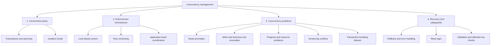

# Concurrency Management: Controls and Problems

## Core idea

**Concurrency management** is the umbrella term for everything a database does to let multiple transactions operate safely at the same time.

It can be organized into four major areas:

1. **Correctness policy** — what each transaction is allowed to observe.
2. **Enforcement mechanisms** — how the database enforces that policy.
3. **Concurrency problems** — what can go wrong or cause delays.
4. **Recovery and application safeguards** — how failures and conflicts are handled.



---

## 1. Correctness policy

This area describes **what correctness guarantees are required**.

### Transactions and atomicity

A transaction treats several operations as one logical unit:

- `COMMIT` makes all its changes permanent.
- `ROLLBACK` cancels all its changes.
- Atomicity means **all of the transaction happens or none of it happens**.

`SET XACT_ABORT ON` supports atomic behavior in SQL Server by automatically terminating and rolling back a transaction for many runtime errors. It is not itself an isolation mechanism.

### Isolation levels

Isolation determines how much one transaction may observe or interfere with another transaction.

From generally weaker to stronger isolation:

1. `READ UNCOMMITTED`
2. `READ COMMITTED`
3. `REPEATABLE READ`
4. `SNAPSHOT` — version-based and not part of the simple lock-strength ordering
5. `SERIALIZABLE`

An isolation level is a **policy**. Locks and row versions are mechanisms used to implement that policy.

---

## 2. Enforcement mechanisms

### Lock-based control

Locks coordinate access to shared data.

| Lock | Umbrella purpose | Typical use |
|---|---|---|
| Shared (`S`) | Read protection | Reading a row |
| Update (`U`) | Update preparation | Intending to update a row |
| Exclusive (`X`) | Write protection | Updating or deleting a row |
| Key-range lock | Predicate/range protection | Preventing phantoms under `SERIALIZABLE` |

Locks may be taken at row, key, page, table, or database-related levels. They can preserve correctness, but they can also produce waiting.

### Row versioning

Row versioning lets readers use a previously committed version of a row rather than waiting for a writer.

It provides consistent reads with less reader–writer blocking, but overlapping writers can still conflict.

### Application-level coordination

The application may add controls when database isolation alone does not express the business requirement:

- Idempotency keys to prevent an operation from running twice.
- Optimistic version columns to detect stale updates.
- `sp_getapplock` or another logical mutex for named business operations.
- A single stored procedure that performs the check and action together.
- Constraints to enforce business invariants.

---

## 3. Concurrency problems

### A. Read anomalies

**Umbrella meaning:** a transaction observes data that is uncommitted, changes between reads, or represents inconsistent moments in time.

| Problem | Meaning | Commonly possible under |
|---|---|---|
| Dirty read | Reading another transaction's uncommitted value | `READ UNCOMMITTED` |
| Non-repeatable read | Reading the same row twice and receiving different results | `READ UNCOMMITTED`, `READ COMMITTED` |
| Phantom read | Repeating a condition query and receiving new or missing qualifying rows | Levels below `SERIALIZABLE`; transaction-level `SNAPSHOT` also prevents it within its snapshot |
| Read skew / inconsistent analysis | Related values are read from different moments | Common with statement-level consistency |

### B. Write and business-rule anomalies

**Umbrella meaning:** concurrent actions produce an incorrect write or violate a rule even though individual statements may succeed.

| Problem | Meaning | Typical safeguard |
|---|---|---|
| Lost update | One transaction overwrites another transaction's result | Atomic updates, locking, version checks |
| Dirty write | One transaction overwrites another's uncommitted write | Exclusive write locks |
| Write skew | Transactions update different rows using the same old assumption and jointly violate a rule | `SERIALIZABLE`, explicit locks, constraints |
| Check-then-act race | Data changes between checking a condition and acting on it | Combine check and action atomically |
| Delete–update race | A delete and update compete for the same row | Locks determine order; business policy determines the intended winner |
| Duplicate operation | A valid operation is accidentally applied more than once | Idempotency key or operation log |

An atomic statement such as:

```sql
UPDATE TrainingSession
SET score = score * 1.10
WHERE session_id = @SessionID;
```

normally avoids a classic read–calculate–write lost update. However, executing the entire statement twice still applies the increase twice. That is a **duplicate business operation**, not a lost update.

### C. Progress and resource problems

**Umbrella meaning:** transactions remain correct but cannot make progress efficiently.

| Problem | Meaning | Typical response |
|---|---|---|
| Blocking | A transaction waits for an incompatible lock | Keep transactions short; add suitable indexes |
| Deadlock | Transactions form a circular wait | SQL Server aborts one; the application retries it |
| Starvation | A transaction is repeatedly delayed or selected as a victim | Fair scheduling, shorter work, retry limits |
| Lock escalation | Many small locks are replaced with a larger lock | Process smaller batches; improve access paths |
| Excessive contention | Many transactions compete for the same data | Reduce hot spots or redesign the workload |

Blocking is not automatically an error. It is a normal coordination effect of lock-based concurrency control. It becomes a problem when the wait is excessive.

### D. Versioning conflicts

**Umbrella meaning:** transactions read consistent versions without blocking, but their later writes cannot all be accepted.

| Problem | Meaning | Typical response |
|---|---|---|
| Snapshot update conflict | Another transaction changed the same row after the snapshot began | Roll back and retry |
| Stale snapshot | A transaction sees a consistent but older database state | Keep transactions short; revalidate before acting |
| Version-store pressure | Old row versions must be retained for long-running readers | Avoid unnecessarily long snapshot transactions |

### E. Transaction-handling failures

**Umbrella meaning:** application or stored-procedure code manages transaction boundaries or failures incorrectly.

| Problem | Consequence | Typical safeguard |
|---|---|---|
| Transaction left open | Locks and resources remain held | Guaranteed `COMMIT`/`ROLLBACK` paths |
| Partial commit | Only part of a logical operation becomes permanent | Explicit transaction and error handling |
| Incorrect nested-transaction handling | Code rolls back or commits more work than intended | Check `@@TRANCOUNT` and transaction ownership |
| Missing retry logic | Deadlock or snapshot victims become user-visible failures | Retry the whole transaction safely |
| Ignoring affected-row counts | An update/delete silently affects no rows | Check `@@ROWCOUNT` |

`@@TRANCOUNT` is the number of active transaction scopes on the current SQL Server connection:

- `BEGIN TRANSACTION` increases it.
- `COMMIT` decreases it by one.
- A full `ROLLBACK` resets it to zero.

---

## 4. Recovery and safeguards

These controls handle the problems after they are detected or prevent them at the business level.

### Database safeguards

- Use the weakest isolation level that still guarantees the required correctness.
- Keep transactions short.
- Access tables and rows in a consistent order.
- Create useful indexes so fewer rows need to be examined or locked.
- Use constraints whenever the rule can be expressed declaratively.

### Stored-procedure safeguards

- Wrap logically indivisible work in a transaction.
- Use `TRY...CATCH` and roll back on failure.
- Use `SET XACT_ABORT ON` when automatic rollback on runtime errors is appropriate.
- Use `@@TRANCOUNT` when a procedure may be called inside another transaction.
- Check `@@ROWCOUNT` when zero affected rows has a special meaning.

### Application safeguards

- Retry deadlock victims and snapshot conflicts.
- Make retryable operations idempotent.
- Use operation identifiers to prevent accidental duplicate execution.
- Define an explicit business rule for races such as delete versus update.

---

## Cause-and-effect summary

| Umbrella choice or cause | Main benefit | Main risk or cost |
|---|---|---|
| Weak isolation | High concurrency and fewer waits | Read anomalies and races |
| Strong lock-based isolation | Stronger consistency | Blocking and deadlocks |
| Row versioning | Consistent reads with less reader–writer blocking | Stale snapshots and update conflicts |
| Long transactions | More work protected as one unit | Longer lock duration or version retention |
| Missing business coordination | Simpler code | Duplicate actions and invariant violations |
| Poor error handling | None | Open transactions, partial work, and unrecovered conflicts |

## One-sentence memory rule

> **Isolation defines the correctness policy; locks and row versions enforce it; anomalies, conflicts, and waiting are the possible outcomes; rollback, retry, validation, and application rules complete the solution.**
