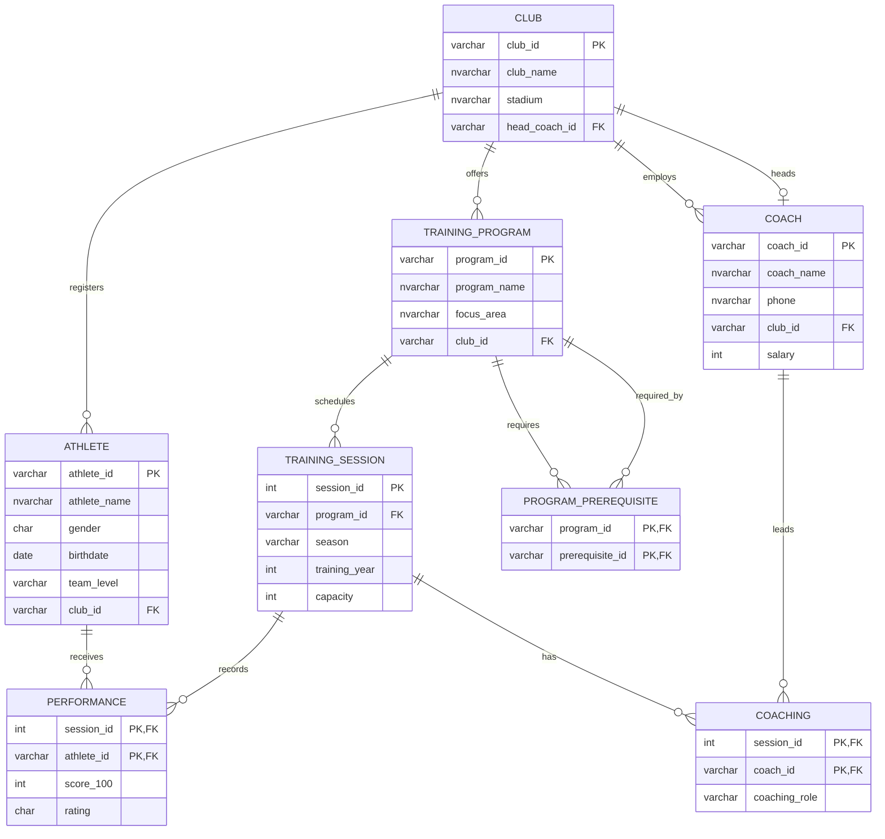

# Practice Final Examination — Sports Training Database

**Course:** Introduction to Databases  
**Database system:** Microsoft SQL Server  
**Difficulty:** Comparable to the University Database final-review test

## Database description

The database stores sports clubs, athletes, coaches, training programs, scheduled training sessions, coaching assignments, athlete performance records, and prerequisite programs.

### Important assumptions

- An athlete is considered to have **passed** a program when `score_100 >= 50`.
- A row in `PERFORMANCE` means that the athlete is or was enrolled in the corresponding training session.
- `score_100` may be `NULL` when the athlete has not yet received a score.
- Each training program belongs to exactly one club.
- `head_coach_id` identifies the coach who leads a club.

## ERD

## Questions

1. Find the names of all training programs that have at least one prerequisite, but none of their prerequisite programs have prerequisites of their own.

2. Identify all coaches who are coaching a training session in the same season and training year as the head coach of their own club.

3. Find all athletes who have taken and passed at least one training program offered by every club in the database.

4. Find the club or clubs whose coaches have the highest average salary.

5. Identify athletes who are currently enrolled in a training program but have not yet passed any of that program's prerequisites. Treat a `PERFORMANCE` row with a `NULL` score as a current enrollment.

6. **CTEs are allowed.** For each club, find the coach who has coached the greatest number of unique training programs. Include ties.

7. Identify the table of influence and write at least one trigger to enforce the following business rule:

   **BR1:** No two training programs belonging to the same club may have the same program name.

8. Write a trigger that performs a cascading delete when a club is deleted. The trigger must remove all dependent records without violating foreign-key constraints.

9. Create a stored procedure that performs the following operations using a given `<athlete_id>` and `<session_id>`:

   a. Read the athlete's current `score_100` in the specified session.  
   b. Wait for 10 seconds.  
   c. Read the same score again.

10. Create a stored procedure that deletes an athlete's performance record using a given `<athlete_id>` and `<session_id>`.

    **Input:** `athlete_id`, `session_id`  
    **Output:** Roll back if either the athlete or the training session does not exist. Otherwise, delete the matching performance record and commit.

11. Create a stored procedure that multiplies an athlete's score by `1.1` using a given `<athlete_id>` and `<session_id>`:

    \[
    \text{new score}=\text{old score}\times 1.1
    \]

    **Input:** `athlete_id`, `session_id`  
    **Output:** If both IDs exist, update the score and commit. If either ID does not exist, make no update and still commit.

12. Use transactions to ensure that the three stored procedures from Questions 9–11 behave as required. Analyze what may happen when any two procedures—or all three procedures—are executed concurrently for the same athlete and session. For each SQL Server isolation level below, identify the concurrency problems that can occur and explain how you would handle them:

    - `READ UNCOMMITTED`
    - `READ COMMITTED`
    - `REPEATABLE READ`
    - `SNAPSHOT`
    - `SERIALIZABLE`

    Your discussion should consider dirty reads, non-repeatable reads, phantom reads, blocking, deadlocks, and competing `DELETE`/`UPDATE` operations where relevant.

### Additional query practice

13. For each club, find the training program or programs with the greatest number of distinct athletes who have passed the program. Include ties and display the club, program, and number of athletes who passed.

14. Find all athletes who have passed every prerequisite of at least one training program but have never enrolled in any session of that program. Return the athlete and the qualifying program.

15. Find all coaches who have coached at least one session of every training program offered by their own club.

16. Find all training sessions whose number of enrolled athletes exceeds the session capacity. Display the session, program name, capacity, enrollment count, and the amount by which the capacity is exceeded.

17. Find pairs of different athletes from the same club who have enrolled in exactly the same set of distinct training programs. Display each pair only once.

---

## Suggested examination conditions

- Questions 1–6 and 13–17: Write `SELECT` queries only, except where a CTE is explicitly allowed.
- Questions 7–8: Clearly state which tables are directly or indirectly affected before writing each trigger.
- Questions 9–11: Use SQL Server stored-procedure syntax and explicit transactions where required.
- Question 12: Explain both the possible execution sequence and the resulting database state.
