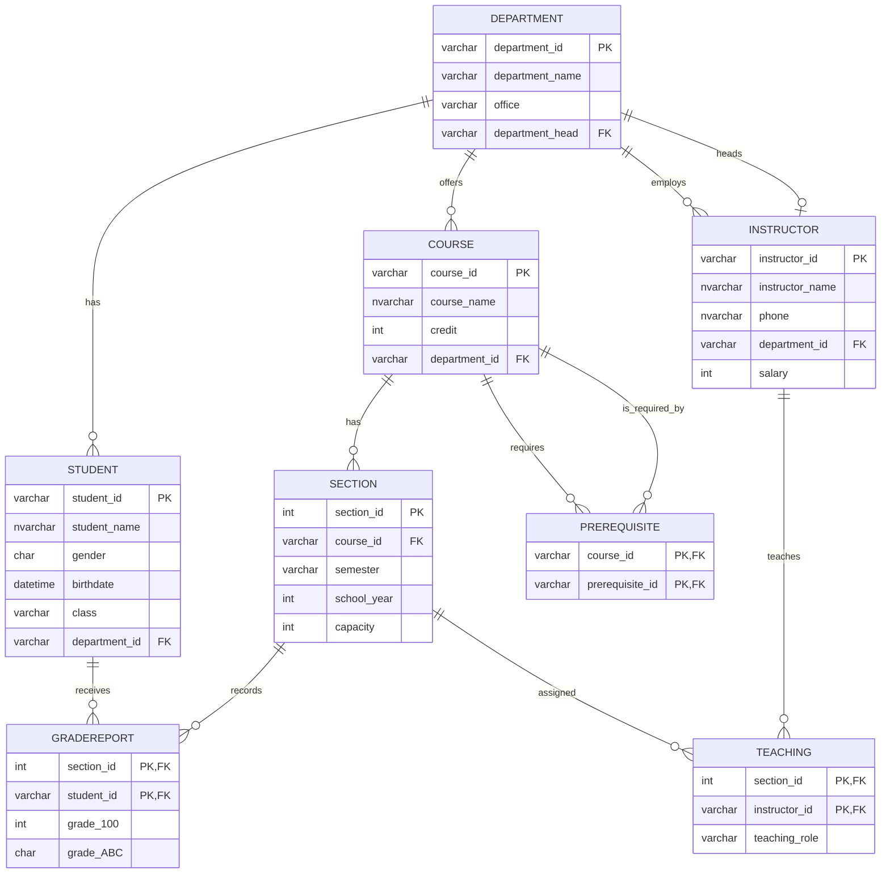

# University Database ERD

This is an Entity–Relationship Diagram (ERD) for the university database.

```mermaid
erDiagram
    DEPARTMENT {
        varchar department_id PK
        varchar department_name
        varchar office
        varchar department_head FK
    }

    STUDENT {
        varchar student_id PK
        nvarchar student_name
        char gender
        datetime birthdate
        varchar class
        varchar department_id FK
    }

    COURSE {
        varchar course_id PK
        nvarchar course_name
        int credit
        varchar department_id FK
    }

    INSTRUCTOR {
        varchar instructor_id PK
        nvarchar instructor_name
        nvarchar phone
        varchar department_id FK
        int salary
    }

    SECTION {
        int section_id PK
        varchar course_id FK
        varchar semester
        int school_year
        int capacity
    }

    TEACHING {
        int section_id PK, FK
        varchar instructor_id PK, FK
        varchar teaching_role
    }

    GRADEREPORT {
        int section_id PK, FK
        varchar student_id PK, FK
        int grade_100
        char grade_ABC
    }

    PREREQUISITE {
        varchar course_id PK, FK
        varchar prerequisite_id PK, FK
    }

    DEPARTMENT ||--o{ STUDENT : has
    DEPARTMENT ||--o{ COURSE : offers
    DEPARTMENT ||--o{ INSTRUCTOR : employs
    INSTRUCTOR o|--|| DEPARTMENT : heads

    COURSE ||--o{ SECTION : has
    SECTION ||--o{ TEACHING : assigned
    INSTRUCTOR ||--o{ TEACHING : teaches

    STUDENT ||--o{ GRADEREPORT : receives
    SECTION ||--o{ GRADEREPORT : records

    COURSE ||--o{ PREREQUISITE : requires
    COURSE ||--o{ PREREQUISITE : is_required_by
```

